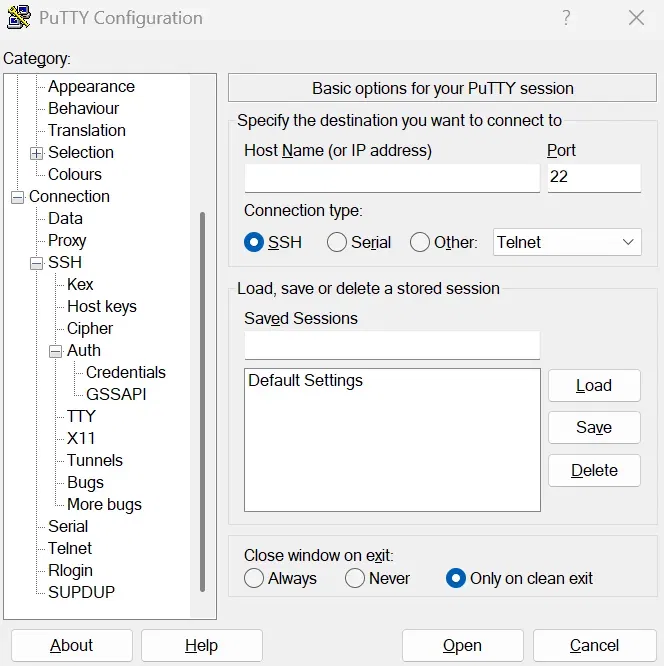

# Deploying a Static Website with Nginx on Docker (Amazon Linux EC2)

## Overview

This project demonstrates two different approaches for deploying a static website using the official Nginx Docker image on an Amazon Linux 2023 EC2 instance.

- **Approach 1** packages the website inside the Docker image using the `COPY` instruction.
- **Approach 2** uses a Docker bind mount, allowing website files to remain on the host machine so that any changes are reflected immediately without rebuilding the image.

This project helps understand the difference between packaging application files inside an image and mounting files from the host.

> **Note:** The `index.html` used in this project is a sample static webpage for demonstration purposes.

---

# Prerequisites

Before starting, ensure you have:

- An AWS account
- An Amazon Linux 2023 EC2 instance
- A Security Group allowing inbound HTTP traffic (Port 80)
- A Key Pair for connecting to the EC2 instance
- PuTTY installed (Windows users)

## Logging into the EC2 Instance

Use PuTTY to connect to your Amazon Linux EC2 instance.
1. Open **PuTTY**.
2. Enter the **Public IPv4 address** of your EC2 instance in the **Host Name (or IP address)** field.
3. Ensure the **Connection type** is set to **SSH**.
4. In the left navigation panel, expand **SSH** → **Auth** → **Credentials**.
5. Under **Private key file for authentication**, click **Browse** and select the `.ppk` file generated from your EC2 key pair.
6. Return to the **Session** category and click **Open**.
7. When prompted, log in using the default Amazon Linux username:



After successful authentication, you will be connected to the EC2 instance through the terminal where you can execute the commands in the following sections.

---

# Installing Docker

Install Docker on the EC2 instance.

```bash
sudo yum install docker -y
```

Start the Docker service.

```bash
sudo service docker start
```

Create the project directory.

```bash
mkdir nginx-static-webpage
cd nginx-static-webpage
```

---

# Project Structure

```
nginx-static-webpage/
│
├── README.md
├── approach1/
│   ├── Dockerfile
│   └── index.html
│
├── approach2/
│   ├── Dockerfile
│   └── hostvolume/
│       └── index.html
│
└── images/
    ├── putty.jpg
    ├── dockerfile-copy.jpg
    ├── dockerfile-volume.jpg
    ├── webpage-before.png
    └── webpage-after.png
```

---

# Approach 1 - Package the Website Inside the Docker Image

In this approach, the website becomes part of the Docker image.

## Step 1: Create the Directory

```bash
mkdir approach1
cd approach1
```

---

## Step 2: Create the Website

```bash
vi index.html
```

Create your HTML webpage and save the file.

---

## Step 3: Create the Dockerfile

```bash
vi Dockerfile
```

```dockerfile
FROM nginx

COPY index.html /usr/share/nginx/html

EXPOSE 80
```

## Step 4: Build the Docker Image

```bash
docker build -t nginx-image .
```

---

## Step 5: Run the Container

```bash
docker run -d --name container1 -p 80:80 nginx-image
```

---

## Step 6: Access the Website

Open your browser and visit:

```
http://<EC2-Public-IP>
```

The website should load successfully.


---

## Stop and Remove the Container

Before starting the second approach, stop and remove the existing container.

```bash
docker stop container1

docker rm container1
```

Return to the project directory.

```bash
cd ..
```

---

## Why Use This Approach?

Advantages

- Packages the website inside the Docker image.
- The image is portable and can be deployed consistently across environments.
- No dependency on files stored on the host machine.

Limitation

- Any change to the website requires rebuilding the Docker image and recreating the container.

---

# Approach 2 - Deploy the Website Using a Docker Bind Mount

Instead of copying the website into the image, this approach stores the website on the host machine and mounts it inside the running container.

Because the container directly accesses the host files, any modifications become visible immediately without rebuilding the image.

## Step 1: Create the Directory

```bash
mkdir approach2
cd approach2
```

Create a directory that will store the website files.

```bash
mkdir hostvolume
```

---

## Step 2: Create the Dockerfile

```bash
vi Dockerfile
```

```dockerfile
FROM nginx

EXPOSE 80
```

## Step 3: Create the Website

Move into the host directory.

```bash
cd hostvolume
```

Create the webpage.

```bash
vi index.html
```

You can use the same HTML file that was created in **Approach 1**.

Return to the `approach2` directory.

```bash
cd ..
```

---

## Step 4: Build the Docker Image

```bash
docker build -t nginx-image-2 .
```

---

## Step 5: Run the Container

```bash
docker run -d --name container2 -p 80:80 -v /home/ec2-user/nginx-static-webpage/approach2/hostvolume:/usr/share/nginx/html nginx-image-2
```

The bind mount maps the host directory to Nginx's web root. Every file inside `hostvolume` becomes available inside the running container.

---

## Step 6: Modify the Website

Edit the HTML file stored on the host.

```bash
vi /home/ec2-user/nginx-static-webpage/approach2/hostvolume/index.html
```

Save the file and refresh the browser.

The updated webpage appears immediately.

No image rebuild is required.

No new container needs to be created.

### Before Editing


### After Editing


---

## Why Use This Approach?

Advantages

- Website files remain outside the Docker image.
- Changes appear immediately in the running container.
- No image rebuild is required.

Limitation

- The container depends on the availability of the host directory.
- The image alone does not contain the website files.

---

# Comparison of Both Approaches

| Feature | Approach 1 (COPY) | Approach 2 (Bind Mount) |
|----------|-------------------|--------------------------|
| Website stored inside the image | Yes | No |
| Requires rebuilding after changes | Yes | No |
| Website updates appear immediately | No | Yes |
| Depends on host files | No | Yes |

---

# Conclusion

Both approaches successfully deploy a static website using Nginx inside a Docker container.

The first approach packages the website directly into the Docker image making it portable and consistent.

The second approach uses a Docker bind mount, allowing the container to access website files stored on the host machine. The container directly uses these files, any modifications are reflected immediately without rebuilding the image.

Understanding both deployment methods helps in selecting the appropriate approach based on the deployment requirements.
